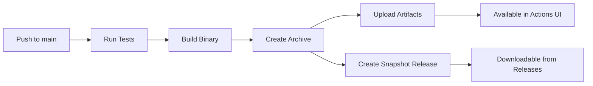

# Build Workflow Changes

## Summary

Your workflow now automatically builds and publishes binary artifacts for every push to `main`. Here's what changed and what you need to know.

## Before → After

### Before ❌
- Binary was built but not easily downloadable
- No automatic releases for `main` branch pushes
- Artifacts only available in Actions UI (expired after 90 days with no release)
- No checksums for verification
- Manual process to get built binaries

### After ✅
- Binary automatically built with full version info
- Snapshot releases created for every `main` push
- Binaries downloadable from Releases page
- Checksums included for verification
- Easy access via GitHub Releases UI
- Artifacts available in multiple formats

## What Happens Now When You Push to Main



1. ✅ Code is tested
2. ✅ Binary is built with version information
3. ✅ Archive is created (binary + README + checksums)
4. ✅ Artifacts uploaded (90-day retention)
5. ✅ Snapshot release created with assets
6. ✅ Binary is publicly downloadable

## File Changes

### 1. `.github/workflows/build.yml`

**Added:**
- `permissions: contents: write` - Allows creating releases
- Version info extraction from git
- Archive creation with README and checksums
- New job: `create-snapshot-release`
- Detailed release notes generation

**Improved:**
- Build flags match Makefile exactly
- Better artifact naming with version
- Two artifact types (binary + archive)
- Full git history available (`fetch-depth: 0`)

### 2. `Makefile`

**Added:**
- `build-all-platforms` - Build for Linux, macOS, Windows
- `BINARY_NAME` variable for consistency
- `dist/` directory for multi-platform builds
- Checksum generation
- Better help documentation

**Improved:**
- Cleaner output directory structure
- Consistent binary naming throughout
- Platform-specific archives (`.tar.gz` for Unix, `.zip` for Windows)

## New Files Created

1. **`GITHUB_SETUP.md`** - Comprehensive setup guide
2. **`.github/WORKFLOW_SUMMARY.md`** - Quick reference
3. **`.github/CHANGES.md`** - This file

## GitHub Configuration Needed

### ✅ Required (verify in Settings → Actions → General)

**Workflow Permissions:**
- Select: **"Read and write permissions"**

That's the only setting you need to verify! Everything else is configured in the workflow files.

### Optional But Recommended

**Branch Protection for `main`:**
1. Settings → Branches → Add rule
2. Branch name: `main`
3. Enable: "Require status checks to pass"
4. Select: `Test` job

## Testing Your Setup

### Step 1: Push to Main
```bash
git add .
git commit -m "Test workflow changes"
git push origin main
```

### Step 2: Monitor Workflow
1. Go to **Actions** tab
2. Watch the workflow run
3. Verify all jobs pass ✅

### Step 3: Check Release
1. Go to **Releases**
2. Find the snapshot release (tagged `snapshot-{sha}`)
3. Verify it's marked as "Pre-release"
4. Check the Assets section

### Step 4: Download and Test
```bash
# Download the archive
wget https://github.com/YOUR_USERNAME/websearch-mcp/releases/download/snapshot-XXX/websearch-mcp-VERSION-linux-amd64.tar.gz

# Extract
tar -xzf websearch-mcp-*-linux-amd64.tar.gz

# Run
chmod +x websearch-mcp
./websearch-mcp
```

## Binary Locations

### During Development
- **Actions UI**: Each workflow run → Artifacts section
- **Retention**: 90 days
- **Access**: Anyone with repo access

### For Distribution
- **Releases Page**: Public/stable releases
- **Snapshot Releases**: Latest `main` branch builds
- **Access**: Public (if repo is public)

## Version Information

Binaries now include:
- **Version**: Git tag or commit SHA
- **Build Time**: UTC timestamp
- **Git Commit**: Short commit hash

Check with:
```bash
./websearch-mcp --version  # (if implemented in main.go)
```

## Release Types

| Type | Trigger | Tag Format | Purpose |
|------|---------|------------|---------|
| **Snapshot** | Push to `main` | `snapshot-{sha}` | Development builds |
| **Official** | Push tag | `v*.*.*` | Stable releases |

### Create Official Release
```bash
# Create and push a version tag
git tag -a v1.0.0 -m "Release version 1.0.0"
git push origin v1.0.0

# The release.yml workflow will:
# - Build the binary
# - Create GitHub Release
# - Attach binary as asset
# - Generate release notes
```

## Platform Support

### Current CI/CD
- ✅ Linux AMD64 (GitHub Actions)

### Local Builds (via Makefile)
- ✅ Linux (amd64, arm64)
- ✅ macOS (Intel, Apple Silicon)
- ✅ Windows (amd64)

Run `make build-all-platforms` to build for all platforms locally.

## Artifact Naming Convention

```
websearch-mcp-{version}-{os}-{arch}.{ext}

Examples:
- websearch-mcp-v1.0.0-linux-amd64.tar.gz
- websearch-mcp-dev-abc1234-linux-amd64.tar.gz
- websearch-mcp-v1.0.0-darwin-arm64.tar.gz
- websearch-mcp-v1.0.0-windows-amd64.zip
```

## Troubleshooting

### ❌ Snapshot releases not appearing

**Fix:**
1. Settings → Actions → General
2. Workflow permissions → "Read and write permissions"
3. Save and re-run workflow

### ❌ Artifacts showing but empty

**Fix:**
- Check workflow logs for build errors
- Ensure `go build` completed successfully
- Verify archive creation step passed

### ❌ Version shows as "dev-unknown"

**Fix:**
- Ensure `fetch-depth: 0` in workflow
- Check git tags exist: `git tag -l`
- First build may show commit hash (normal)

## Next Steps

1. ✅ Verify GitHub Actions permissions
2. ✅ Push to `main` to trigger workflow
3. ✅ Check Actions tab for successful run
4. ✅ Verify snapshot release created
5. ✅ Download and test binary
6. ✅ (Optional) Set up branch protection
7. ✅ (Optional) Create first official release

## Questions?

- Check workflow logs in Actions tab
- Review `GITHUB_SETUP.md` for detailed info
- See `WORKFLOW_SUMMARY.md` for quick commands
