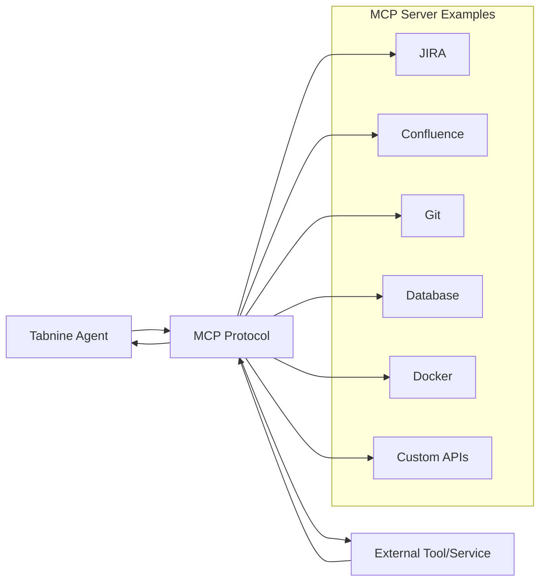

# Introduction to MCP (Model Context Protocol)

The Model Context Protocol (MCP) is a powerful communication protocol that enables Tabnine Agents to seamlessly connect with external tools and services, dramatically expanding their capabilities beyond code analysis and generation.

## 🔗 What is MCP?

MCP is a standardized protocol that allows AI agents to invoke external tools without the complexity of manually wiring APIs. Think of it as a universal translator that lets your agent communicate with any service that supports MCP.

### Key Benefits

- **Universal Integration**: Connect to any MCP-compatible service
- **Natural Language Interface**: Agents understand when and how to use tools
- **Automated Parameter Handling**: No manual API configuration needed
- **Seamless Workflow Integration**: Tools become part of your agent's capabilities

## 🏗️ How MCP Works



### The MCP Flow

1. **Tool Description**: MCP servers provide natural language descriptions of their capabilities
2. **Intelligent Selection**: Agents understand when to use specific tools based on context
3. **Parameter Mapping**: Agents automatically format parameters correctly
4. **Response Processing**: Agents interpret tool responses and integrate them into workflows

## 🛠️ Available MCP Integrations

### Development Tools

**Git Operations**
- Repository management
- Branch operations
- Commit history analysis
- Merge conflict resolution

**Docker & Containers**
- Container management
- Image building and deployment
- Service orchestration
- Environment setup

### Project Management

**JIRA Integration**
- Issue creation and management
- Sprint planning
- Status updates
- Progress tracking

**Confluence**
- Documentation access
- Knowledge base queries
- Content creation
- Team collaboration

### Database Tools

**Database Operations**
- Query execution
- Schema management
- Data analysis
- Performance monitoring

### Cloud Services

**AWS/Azure/GCP**
- Resource provisioning
- Deployment automation
- Monitoring and logs
- Security management

### Custom Integrations

**Your Own APIs**
- Internal tool integration
- Custom workflow automation
- Legacy system access
- Specialized functionality

## 🎯 MCP Use Cases

### Automated Workflows

**Feature Development + Project Management**
```
You: "Implement user authentication and update the project tracker"
Agent:
1. 🏗️ Implements authentication code
2. 🎫 Creates JIRA tickets for testing
3. 📝 Updates Confluence documentation
4. 🔄 Commits changes to Git
5. 📊 Updates project status
```

**Bug Investigation + Resolution**
```
You: "Investigate database performance issues"
Agent:
1. 🔍 Queries database performance metrics
2. 📊 Analyzes slow query logs
3. 🎫 Creates JIRA issue with findings
4. 🔧 Implements optimizations
5. ✅ Validates improvements
```

### Cross-Platform Operations

**Code + Documentation + Deployment**
```
You: "Deploy the new feature to staging"
Agent:
1. 🧪 Runs tests via testing tools
2. 🐳 Builds Docker images
3. ☁️ Deploys to cloud platform
4. 📝 Updates deployment documentation
5. 👥 Notifies team via Slack
```

## 🔧 Technical Requirements

### Prerequisites

- **Tabnine Agent Mode**: MCP requires tool-calling capabilities
- **Node.js Runtime**: For most MCP server implementations
- **Docker** (optional): For containerized MCP servers
- **Network Access**: To communicate with external services

### Security Considerations

- **Authentication**: MCP servers handle service authentication
- **Permissions**: Agents respect tool permission boundaries
- **Data Privacy**: Sensitive data stays within your environment
- **Audit Trail**: All tool interactions are logged

## 📋 MCP Server Configuration

MCP servers are configured through a `.mcp_servers` file in your project root:

```json
{
  "mcpServers": {
    "server-name": {
      "command": "server-executable",
      "args": ["arg1", "arg2"],
      "env": {
        "API_KEY": "your-api-key",
        "BASE_URL": "https://api.example.com"
      }
    }
  }
}
```

### Configuration Components

- **Command**: The executable or script that runs the MCP server
- **Arguments**: Command-line arguments for the server
- **Environment**: Environment variables for authentication and configuration

## 🚀 Getting Started with MCP

### Step 1: Choose Your Integration
Identify which external tools would benefit your workflow:
- Project management (JIRA, GitHub Issues)
- Documentation (Confluence, Notion)
- Infrastructure (AWS, Docker)
- Databases (PostgreSQL, MongoDB)

### Step 2: Set Up MCP Server
Each tool has its own MCP server implementation. Most are available as:
- Docker containers
- Node.js packages
- Python scripts
- Pre-built binaries

### Step 3: Configure Tabnine
Add the MCP server configuration to your `.mcp_servers` file with appropriate credentials and settings.

### Step 4: Test Integration
Verify the connection by asking your agent to interact with the service:
```
"Can you see the JIRA MCP server?"
"List my recent JIRA issues"
```

## 🎨 Best Practices

### Tool Selection
- **Start Small**: Begin with one or two critical integrations
- **Focus on Workflow**: Choose tools that automate your most common tasks
- **Consider Security**: Ensure proper authentication and permissions

### Configuration Management
- **Environment Variables**: Use env vars for sensitive information
- **Version Control**: Track MCP configurations (excluding secrets)
- **Documentation**: Document your MCP setup for team members

### Agent Interactions
- **Be Specific**: Clearly state which tools should be used when needed
- **Understand Limitations**: Know what each tool can and cannot do
- **Monitor Usage**: Track tool usage and effectiveness

## 🔍 Troubleshooting MCP

### Common Issues

**Connection Problems**
- Verify MCP server is running
- Check network connectivity
- Validate authentication credentials

**Permission Errors**
- Ensure proper API permissions
- Verify service account configuration
- Check rate limiting settings

**Performance Issues**
- Monitor tool response times
- Consider caching strategies
- Optimize query patterns

### Debugging Steps

1. **Check Logs**: Review Tabnine logs for MCP errors
2. **Test Manually**: Verify tool works outside of MCP
3. **Validate Config**: Ensure `.mcp_servers` file is correct
4. **Update Servers**: Keep MCP servers up to date

## 🔮 What's Next?

Ready to set up MCP with Tabnine Agents? Continue to:
- [MCP Setup Guide](./mcp-setup.md) - Step-by-step configuration
- [MCP Examples](./mcp-examples.md) - Real-world use cases and implementations